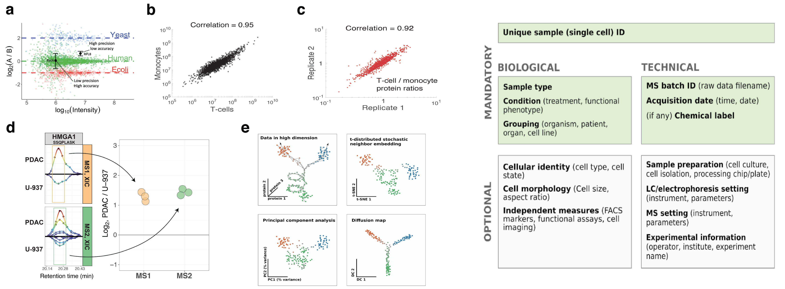

# Community guidelines and recommendations

&nbsp;

{: .fs-6 }
This page aims to collect and organize community guidelines and recommendations for performing, benchmarking, and reporting single-cell proteomics experiments

-------

## Initial recommendations from a community white paper
[*Performing, benchmarking, and reporting single-cell proteomics experiments*](https://www.nature.com/articles/s41592-023-01785-3), *Nature Methods*, **20**, 375--386 (2023) doi: [10.1038/s41592-023-01785-3](https://doi.org/10.1038/s41592-023-01785-3), [Blog](https://blog.slavovlab.net/2023/03/04/guidelines-for-single-cell-proteomic-experiments/)
* [GitHub Code](https://github.com/SlavovLab/SCP_recommendations)
* [Example *README* file](https://www.nature.com/articles/s41592-023-01785-3#Sec29)
* [Example *Data websites*](https://scp.slavovlab.net/data)

{:width="90%" .center-image}

&nbsp;

> We expect that broadly accepted community guidelines and standardized metrics will enhance rigor, data quality and alignment between laboratories.

[The *Nature Methods* white paper](https://www.nature.com/articles/s41592-023-01785-3) proposed best practices, quality controls and data-reporting recommendations to assist in the broad adoption of reliable quantitative workflows for single-cell proteomics.

---------

&nbsp;

## Suggest guidelines
Please recommend best practices, benchmarks, or reporting standards for single-cell proteomics experiments using this **[Google Form](https://forms.gle/STQAgqmkZUX82U3A6)**.
{: .fs-5 }

&nbsp;

## Discuss guidelines and recommendations
Please discuss best practices, benchmarks, or reporting standards for single-cell proteomics experiments using this **[Google Group](https://groups.google.com/g/single_cell_proteomics)**.
{: .fs-5 }

---------

&nbsp;

&nbsp;
