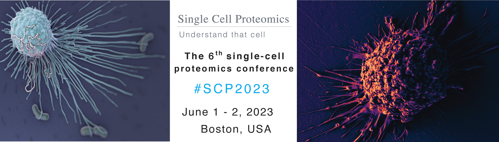



# SCP2023
## June 1 - 2,  2023   &nbsp; |  &nbsp;  Boston, USA
### [Workshop](#workshop) on May 31, 2023  

&nbsp;

[Register](#register-and-submit-abstracts){: .btn .fs-5 .mb-4 .mb-md-0 .mr-2 }
[Program](#program){: .btn .fs-5 .mb-4 .mb-md-0 .mr-2 }
[Speakers](#speakers){: .btn .fs-5 .mb-4 .mb-md-0 .mr-2 }
[Sponsors](#sponsors){: .btn .fs-5 .mb-4 .mb-md-0 .mr-2 }

&nbsp;

{:width="80%" .center-image}

&nbsp;

The 6th Single Cell Proteomics Conference (SCP2023) will be held at Northeastern University in Boston, USA. It will include virtual components via Zoom.
* The **in-person meeting** will be at [Northeastern University](https://center.single-cell.net/) in the [John D. O'Bryant building](https://goo.gl/maps/bmtkmHuFHGC9w8Db8), 1st floor (<a href="https://www.northeastern.edu/campusmap/printable/campusmap15.pdf">40 Leon Street</a>). To cover the expenses for meals, it charges a registration fee. Attendance is limited to *150* participants.
* The **virtual components** are free of charge but require a registration. The Zoom attendance is limited to *250* attendees.

## Register and submit abstracts
<!--

<a href="https://forms.gle/RoeYjf5g2XS2uaff9" target="_blank" rel="noopener noreferrer">Apply for student scholarship</a> 

Application deadline: April 15, 2023

<a href="https://forms.gle/tLPeZ84HgCUPdr3L9" target="_blank" rel="noopener noreferrer">Submit an abstract</a>

Abstract deadline: April 15, 2023

-->

<a href=" https://commerce.cashnet.com/SFSCP" target="_blank" >Register for <strong>in-person</strong> SCP2023</a>

Deadline: May 25, 2023  
<a href="https://single-cell.net/SCP_Meeting/Hotels_2023" target="_blank" rel="noopener noreferrer">Reserve a hotel</a>

<a href="https://forms.gle/EK57PTcNzFMCzd4u9" target="_blank" >Register for <strong>virtual</strong> SCP2023</a>

Deadline: May 30, 2023

 
 

Enjoy recorded <a href="http://youtube.slavovlab.net" >presentations</a> from past <a href="https://slavovlab.net/research.htm#Single-Cell-Proteomics-Conference" >SCP meetings</a>.

 
 

## Program
* [Wednesday May 31](#workshop)
* [Thursday June 1](#day1)
* [Friday June 2](#day2)

**[Locations and transportation directions](https://single-cell.net/proteomics/Transportation)**

 
 

<strong>Wednesday May 31 | Workshop</strong> 

 

A full day hand-on workshop at [PTI](https://www.parallelsq.org/) will take participants from biological samples through sample preparation via [nPOP](https://scp.slavovlab.net/nPOP) to mass spectrometry data acquisition and analysis.
 * Participation is free with in-person conference registration but requires **[Workshop Registration](https://forms.gle/WMsWVgqTNF9Zj7Z66)**. To facilitate interactions and hands-on experience, participation is limited. *The workshop is over-subscribed, and the registration is closed.*    

 

&nbsp;

 

&nbsp;

 

<strong>Thursday June 1</strong> 

 

The day will start with *workshop presentations* covering technological innovations, including a primer and overview of current trends in single-cell proteomics. Then we will transition to talks and discussions. As usual for the meeting, we will have ample time for formal and informal discussions.   

*Breakfast and lunch will be provided on site. All attendees are welcome to dinner.*

<table class="SCPtable"><tr><td> Speaker </td><td> Title </td><td> ET </td><td> GMT </td><td> Your local time </td></tr>
<tr><td>  </td><td> Registration and breakfast </td><td> 8:30 </td><td> 12:30 </td><td>  </td></tr>
<tr><td>  </td><td> Opening remarks </td><td> 9:00 </td><td> 13:00 </td><td>  </td></tr>
<tr><td> Nikolai Slavov, Northeastern University and PTI </td><td> Current trends in single-cell proteomics by mass-spectrometry </td><td> 9:15 </td><td> 13:15 </td><td>  </td></tr>
<tr><td>  </td><td> Discussion  </td><td> 9:35 </td><td> 13:35 </td><td>  </td></tr>
<tr><td> Panel </td><td> Panel Discussion: How to make the technologies more acceiisble </td><td> 9:50 </td><td> 13:50 </td><td>  </td></tr>
<tr><td>  </td><td> General discussion & Coffee Break </td><td> 10:20 </td><td> 14:20 </td><td>  </td></tr>
<tr><td> Mattew Willetts, Bruker Daltonics Inc </td><td> The benefits of trapped ion mobility for single-cell proteomics </td><td> 11:00 </td><td> 15:00 </td><td>  </td></tr>
<tr><td>  </td><td> Discussion  </td><td> 11:20 </td><td> 15:20 </td><td>  </td></tr>
<tr><td> Luke Khoury, Northeastern University </td><td>Single-cell proteomics with new mass spectrometry platforms </td><td> 11:30 </td><td> 15:30 </td><td>  </td></tr>
<tr><td>  </td><td> Discussion  </td><td> 11:50 </td><td> 15:50 </td><td>  </td></tr>
<tr><td>  </td><td> Lunch Break  & Poster session </td><td> 12:00 </td><td> 16:00 </td><td>  </td></tr>
<tr><td> Sabrina Spencer, University of Colorado </td><td> TBD </td><td> 1:30 </td><td> 17:30 </td><td>  </td></tr>
<tr><td>  </td><td> Discussion  </td><td> 2:00 </td><td> 18:00 </td><td>  </td></tr>
<tr><td> Neil Kelleher, Northeastern University </td><td> Defining Cellular Landscapes using Proteoform Imaging Mass Spectrometry </td><td> 2:15 </td><td> 18:15 </td><td>  </td></tr>
<tr><td>  </td><td> Discussion  </td><td> 2:45 </td><td> 18:45 </td><td>  </td></tr>
<tr><td>  </td><td> Coffee Break & Poster session  </td><td> 3:00 </td><td> 19:00 </td><td>  </td></tr>
<tr><td> Ryan Kelly, Brigham Young University </td><td> Improved separations and data acquisition strategies for single-cell proteomics </td><td> 4:00 </td><td> 20:00 </td><td>  </td></tr>
<tr><td>  </td><td> Discussion  </td><td> 4:30 </td><td> 20:30 </td><td>  </td></tr>
<tr><td> Kristin Burnum-Johnson, PNNL </td><td> Mapping Microhabitats in Environmental Systems with Metabolome Informed Proteome Imaging </td><td> 4:45 </td><td> 20:45 </td><td>  </td></tr>
<tr><td>  </td><td> Discussion  </td><td> 5:15 </td><td> 21:15 </td><td>  </td></tr>
<tr><td> Ben Orsburn, Johns Hopkins </td><td> Single cell proteomics in the context of pharmacokinetics </td><td> 5:30 </td><td> 21:30 </td><td>  </td></tr>
<tr><td>  </td><td> Discussion  </td><td> 5:50 </td><td> 21:50 </td><td>  </td></tr>
<tr><td> Dinner for all attendees  </td><td> Eddie V's  </td><td> 6:30 </td><td> 22:30 </td><td>  </td></tr>
</table>

 

&nbsp;

 

&nbsp;
 

<strong>Friday June 2</strong> 

 

A full day of talks and discussions. As usual for the meeting, we will have ample time for formal and informal discussions.   

*Breakfast and lunch will be provided on site. All attendees are welcome to dinner.*

 

<table class="SCPtable"><tr><td> Speaker </td><td> Title </td><td> ET </td><td> GMT </td><td> Your local time </td></tr>
<tr><td>  </td><td> Registration and breakfast </td><td> 8:30 </td><td> 12:30 </td><td>  </td></tr>
<tr><td> Theodore Alexandrov, EMBL </td><td> TDB </td><td> 9:00 </td><td> 13:00 </td><td>  </td></tr>
<tr><td>  </td><td> Discussion  </td><td> 9:30 </td><td> 13:30 </td><td>  </td></tr>
<tr><td> Panel </td><td> Panel Discussion: Major opportunities </td><td> 9:45 </td><td> 13:45 </td><td>  </td></tr>
<tr><td>  </td><td> General discussion & Coffee Break </td><td> 10:15 </td><td> 14:15 </td><td>  </td></tr>
<tr><td> Nikolai Slavov, Northeastern University and PTI </td><td> Biological and technological frontiers for single-cell proteomics </td><td> 10:45 </td><td> 14:45 </td><td>  </td></tr>
<tr><td>  </td><td> Discussion  </td><td> 11:15 </td><td> 15:15 </td><td>  </td></tr>
<tr><td> Jeroen Krijgsveld, Heidelberg University </td><td> Single Cell Proteomics applied to better characterize cardiac cell proteome with a label-free approach </td><td> 11:30 </td><td> 15:30 </td><td>  </td></tr>
<tr><td>  </td><td> Discussion  </td><td> 11:50 </td><td> 15:50 </td><td>  </td></tr>
<tr><td>  </td><td> Lunch Break  & Poster session </td><td> 12:00 </td><td> 16:00 </td><td>  </td></tr>
<tr><td> Emma Lundberg, Stanford University </td><td> Mapping and modeling the spatiotemporal proteome architecture of human cells </td><td> 1:30 </td><td> 17:30 </td><td>  </td></tr>
<tr><td>  </td><td> Discussion  </td><td> 2:00 </td><td> 18:00 </td><td>  </td></tr>
<tr><td> Xiao Wang, Massachusetts Institute of Technology </td><td> Spatially Resolved Single-cell Translatomics </td><td> 2:15 </td><td> 18:15 </td><td>  </td></tr>
<tr><td>  </td><td> Discussion  </td><td> 2:45 </td><td> 18:45 </td><td>  </td></tr>
<tr><td>  </td><td> Coffee Break </td><td> 3:00 </td><td> 19:00 </td><td>  </td></tr>
<tr><td> Erwin Schoof, Technical University of Denmark </td><td> scp-MS for next-generation experimental hematopoiesis  </td><td> 3:30 </td><td> 19:30 </td><td>  </td></tr>
<tr><td>  </td><td> Discussion  </td><td> 3:50 </td><td> 19:50 </td><td>  </td></tr>
<tr><td> Alexander Ivanov, Northeastern University </td><td> Assessment of alternative molecular modalities in omic profiling of small cell populations and single cells. </td><td> 4:00 </td><td> 20:00 </td><td>  </td></tr>
<tr><td>  </td><td> Discussion  </td><td> 4:20 </td><td> 20:20 </td><td>  </td></tr>
<tr><td> Ying Zhu, Gnenetch </td><td> Improving the throughput and resolution of spatial proteomics  </td><td> 4:30 </td><td> 20:30 </td><td>  </td></tr>
<tr><td>  </td><td> Discussion  </td><td> 4:50 </td><td> 20:50 </td><td>  </td></tr>
<tr><td>  </td><td> General discussion &  Break </td><td> 5:00 </td><td> 21:00 </td><td>  </td></tr>
<tr><td> Meni Wanunu, Northeastern University </td><td> Single-molecule proteomics using nanopores </td><td> 5:30 </td><td> 21:30 </td><td>  </td></tr>
<tr><td>  </td><td> Discussion  </td><td> 5:50 </td><td> 21:50 </td><td>  </td></tr>
<tr><td> Brian Reed, Quantum-Si </td><td> Advances in single-molecule protein sequencing on the Quantum-Si platform </td><td> 6:00 </td><td> 22:00 </td><td>  </td></tr>
<tr><td>  </td><td> Discussion  </td><td> 6:20 </td><td> 22:20 </td><td>  </td></tr>
<tr><td>  </td><td> Prizes & Closing Remarks  </td><td> 6:30 </td><td> 22:30 </td><td>  </td></tr>
</table>

 

## Speakers
*Presenters include:*
* Theodore Alexandrov, EMBL <!--  I will schedule your talk for Friday Jun 2nd -->
* Kristin Burnum-Johnson, PNNL
* Ryan Kelly, Brigham Young University
* Neil Kelleher, Northwestern University
* Jeroen Krijgsveld, Heidelberg University
* Emma Lundberg, Stanford University
* Brian Reed, Quantum-Si
* Erwin Schoof, Technical University of Denmark
* Sabrina Spencer, University of Colorado
* Xiao Wang, Massachusetts Institute of Technology
* Meni Wanunu, Northeastern University

 
 
 
 

&nbsp;

  
<strong><a href="#program">Back to the Program</a></strong>

&nbsp;

<!-- * John Yates, The Scripps Research Institute -->

<!--
 ?
*  ?
-->

<!--
* Nikolai Slavov, Northeastern University
* Peter Nemes, University of Maryland
* Alexey Nesvizhskii, University of Michigan
* Aleksandra Petelski, Northeastern University
* Chris Rose, Genentech

* Savas Tay, University of Chicago
* Catherine Wong, Peking University Health Science Center

## Speakers

* Kristin Burnum-Johnson, PNNL
* Jürgen Cox,	Max Planck Institute of Biochemistry
* Amy Herr, UC Berkeley
* Ryan Kelly, Brigham Young University
* Jeroen Krijgsveld, Heidelberg University
* Emma Lundberg, KTH Royal Institute of Technology
* Matthias Mann, Max Planck Institute of Biochemistry
* Peter Nemes, University of Maryland
* Nikolai Slavov,	Northeastern University
* Peter Smibert, New York Genome Center
* John Yates, The Scripps Research Institute

* Ruedi Aebersold, ETH Zurich
* Chloe Baron, Harvard Medical School
* Sean Bendall, Stanford University

* Bogdan Budnik, Harvard University
* Akos Vegvari, Karolinska Institutet
* Catherine Wong, Peking University Health Science Center
* Sydney Shaffer, University of Pennsylvania
* Tami Geiger,	Tel Aviv University
* Luca Pinello, Harvard Medical School
* Jessica, Polka, ASAPbio  

{:.no_toc}

* Will be replaced with the ToC, excluding the section header
{:toc}

-->

&nbsp;

# Sponsors

## Platinum sponsors

{:width="50%" .center-image}

&nbsp;

&nbsp;

{:width="60%" .center-image}

&nbsp;

&nbsp;

<!--[{:width="60%" .center-image}](https://www.parallelsq.org)-->
[{:width="60%" .center-image}](https://www.parallelsq.org)

&nbsp;

&nbsp;

&nbsp;

## Gold sponsors

{:width="50%" .center-image}

&nbsp;

&nbsp;

## Silver sponsors

[{:width="30%" .center-image}](https://ionopticks.com/)

&nbsp;

&nbsp;

 {:width="30%" .center-image}

&nbsp;

&nbsp;

<!--

{:width="30%" .center-image}

&nbsp;

&nbsp;

&nbsp;
  -->

<strong><a href="#program">Back to the Program</a></strong>

  &nbsp;

  &nbsp;
