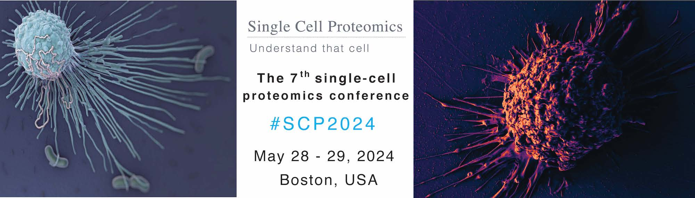



# SCP2024
## May 28 - 29,  2024   &nbsp; |  &nbsp;  Boston, USA
### [Hands-on workshop](#workshop) on May 30, 2024  

&nbsp;

[Register](#register-and-submit-abstracts){: .btn .fs-5 .mb-4 .mb-md-0 .mr-2 }
[Program](#program){: .btn .fs-5 .mb-4 .mb-md-0 .mr-2 }
[Speakers](#speakers){: .btn .fs-5 .mb-4 .mb-md-0 .mr-2 }
[Sponsors](#sponsors){: .btn .fs-5 .mb-4 .mb-md-0 .mr-2 }

&nbsp;

{:width="80%" .center-image}

&nbsp;

The 7th Single Cell Proteomics Conference (SCP2024) will be held at Northeastern University in Boston, USA. It will be at [Northeastern University](https://center.single-cell.net/) in the [John D. O'Bryant building](https://goo.gl/maps/bmtkmHuFHGC9w8Db8), 1st floor (<a href="https://www.northeastern.edu/campusmap/printable/campusmap15.pdf">40 Leon Street</a>).

## Register and submit abstracts

<a href="https://forms.gle/nKmZ3voseB2AMcRv7" target="_blank" rel="noopener noreferrer">Apply for student scholarship</a> 

Application deadline: April 15, 2024

<a href="https://forms.gle/8GkLyghhcMo8NDXj6" target="_blank" rel="noopener noreferrer">Submit an abstract</a>

Abstract deadline: April 15, 2024

<a href=" https://commerce.cashnet.com/SFSCP" target="_blank" >Register for SCP2024</a>

Deadline: May 20, 2024  
<a href="https://single-cell.net/SCP_Meeting/Hotels_2024" target="_blank" rel="noopener noreferrer">Reserve a hotel</a>

 
 

Enjoy recorded <a href="https://www.youtube.com/@NikolaiSlavovResearch/playlists?view=50&sort=dd&shelf_id=2" >presentations</a> from past <a href="https://slavovlab.net/research.htm#Single-Cell-Proteomics-Conference" >SCP meetings</a>.

 
 

## Program
* [Tuesday May 28](#day1)
* [Wednesday May 29](#day2)
* [Thursday May 30](#workshop)

 
 

&nbsp;

 

&nbsp;

 

<strong>Tuesday May 28</strong> 

 

The day will start with *workshop presentations* covering technological innovations, including a primer and overview of current trends in single-cell proteomics. Then we will transition to talks and discussions. As usual for the meeting, we will have ample time for formal and informal discussions.   

*Breakfast and lunch will be provided on site. All attendees are welcome to dinner.*

<table class="SCPtable"><tr><td> Speaker </td><td> Title </td><td> ET </td><td> GMT </td><td> Your local time </td></tr>

</table>

 

&nbsp;

 

&nbsp;
 

<strong>Wednesday May 29</strong> 

 

A full day of talks and discussions. As usual for the meeting, we will have ample time for formal and informal discussions.   

*Breakfast and lunch will be provided on site. All attendees are welcome to dinner.*

 

<table class="SCPtable"><tr><td> Speaker </td><td> Title </td><td> ET </td><td> GMT </td><td> Your local time </td></tr>

</table>

 

<strong>Thursday May 30 | Workshop</strong> 

 

A full day hand-on workshop at [PTI](https://www.parallelsq.org/) will take participants from biological samples through sample preparation via [nPOP](https://scp.slavovlab.net/nPOP) to mass spectrometry data acquisition and analysis.
 * Participation is free with in-person conference registration but requires **[Workshop Registration](https://forms.gle/fEuNwKsyi9JjRWqT9)**. To facilitate interactions and hands-on experience, participation is limited.
 <!--  *The workshop is over-subscribed, and the registration is closed.*    -->

 

## Speakers
*Presenters include:*
* Frank Albert, University of Minnesota
* Scott Coyle, University of Wisconsin-Madison
* Juergen Cox, Max Planck Institute of Biochemistry
* Tami Geiger, Weizmann Institute of Science
* Ryan Kelly, Brigham Young University
* Jeff Nivala, University of Washington
* Jasper Olsen, University of Copenhagen
* Peter Sorger, Harvard Medical School
* Chris Tape, University College London
* Olga Vitek, Northeastern University
* Catherine Wong, Peking University Health Science Center

<!-- limacinA92
* Theodore Alexandrov, EMBL  
* Kristin Burnum-Johnson, PNNL
* Ryan Kelly, Brigham Young University
* Neil Kelleher, Northwestern University
* Jeroen Krijgsveld, Heidelberg University
* Emma Lundberg, Stanford University
* Brian Reed, Quantum-Si
* Erwin Schoof, Technical University of Denmark
* Nikolai Slavov, Northeastern University
* Sabrina Spencer, University of Colorado
* Xiao Wang, Massachusetts Institute of Technology
* Meni Wanunu, Northeastern University
-->

 
 
 
 

&nbsp;

  
<strong><a href="#program">Back to the Program</a></strong>

&nbsp;

&nbsp;

# Sponsors

## Platinum sponsors

{:width="50%" .center-image}

&nbsp;

&nbsp;

{:width="60%" .center-image}

&nbsp;

&nbsp;

## Gold sponsors

[{:width="60%" .center-image}](https://www.parallelsq.org)

&nbsp;

&nbsp;

## Silver sponsors

[{:width="30%" .center-image}](https://ionopticks.com/)

&nbsp;

&nbsp;

<strong><a href="#program">Back to the Program</a></strong>

  &nbsp;

  &nbsp;

<!--
* Peter Nemes, University of Maryland
* Alexey Nesvizhskii, University of Michigan
* Aleksandra Petelski, Northeastern University
* Chris Rose, Genentech

* Savas Tay, University of Chicago
* Catherine Wong, Peking University Health Science Center

## Speakers

* Kristin Burnum-Johnson, PNNL
* Jürgen Cox,	Max Planck Institute of Biochemistry
* Amy Herr, UC Berkeley
* Ryan Kelly, Brigham Young University
* Jeroen Krijgsveld, Heidelberg University
* Emma Lundberg, KTH Royal Institute of Technology
* Matthias Mann, Max Planck Institute of Biochemistry
* Peter Nemes, University of Maryland
* Nikolai Slavov,	Northeastern University
* Peter Smibert, New York Genome Center
* John Yates, The Scripps Research Institute

* Ruedi Aebersold, ETH Zurich
* Chloe Baron, Harvard Medical School
* Sean Bendall, Stanford University

* Bogdan Budnik, Harvard University
* Akos Vegvari, Karolinska Institutet
* Catherine Wong, Peking University Health Science Center
* Sydney Shaffer, University of Pennsylvania
* Tami Geiger,	Tel Aviv University
* Luca Pinello, Harvard Medical School
* Jessica, Polka, ASAPbio  

{:.no_toc}

* Will be replaced with the ToC, excluding the section header
{:toc}

{:width="30%" .center-image}

&nbsp;

&nbsp;

{:width="30%" .center-image}

&nbsp;

&nbsp;

&nbsp;
-->
