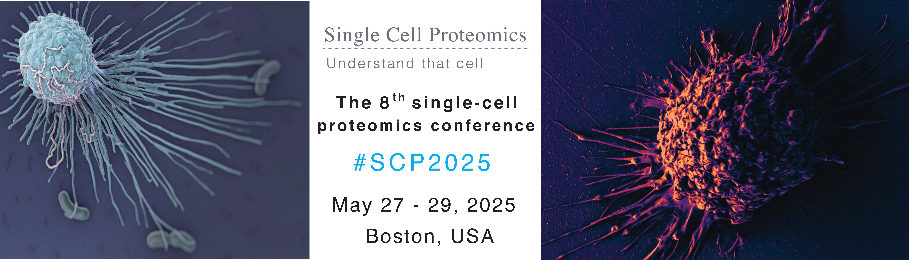



# SCP2025
## May 27 - 28,  2025   &nbsp; |  &nbsp;  Boston, USA
### [Hands-on workshop](#workshop) on May 29, 2025
Workshop attendance is separate from the conference. Save your spot by signing up with the workshop registration form.

&nbsp;

[Register](#register-and-submit-abstracts){: .btn .fs-5 .mb-4 .mb-md-0 .mr-2 }
[Program](#program){: .btn .fs-5 .mb-4 .mb-md-0 .mr-2 }
[Speakers](#speakers){: .btn .fs-5 .mb-4 .mb-md-0 .mr-2 }
[Sponsors](#sponsors){: .btn .fs-5 .mb-4 .mb-md-0 .mr-2 }

&nbsp;

{:width="80%" .center-image}

&nbsp;

The 8th Single Cell Proteomics Conference (SCP2025) will be held at Northeastern University in Boston, USA. It will be at [Northeastern University](https://center.single-cell.net/) in the [John D. O'Bryant building](https://goo.gl/maps/bmtkmHuFHGC9w8Db8), 1st floor (<a href="https://www.northeastern.edu/campusmap/printable/campusmap15.pdf">40 Leon Street</a>).

<!--
We will also broadcast **virtual components**. Virtual attendance is free of charge but requires a [registration](#virtual).
-->

## Register and submit abstracts

<a href="https://forms.gle/d4LbhQqJRhQ2RYZU8" target="_blank" >Register for <strong>virtual</strong> SCP2025</a>

Deadline: May 26, 2025

Register for SCP2025

In person registration is closed due to limited space. Please contact slavov.office@parallelsq.org to be put on a waitlist.  
  
<a href="https://single-cell.net/SCP_Meeting/Hotels_2025" target="_blank" rel="noopener noreferrer">Reserve a hotel</a>

<a href="https://forms.gle/jA11ZoiPZgB2oEzt8" target="_blank" rel="noopener noreferrer">Submit an abstract</a>

Abstract deadline: April 1, 2025

<!--

<a href="https://forms.gle/2G493pgjJCg9DwK49" target="_blank" >Register for <strong>virtual</strong> SCP2025</a>

Deadline: May 27, 2024

<a href="https://forms.gle/2G493pgjJCg9DwK49" target="_blank" >Register for <strong>virtual</strong> SCP2024</a>

Deadline: May 27, 2024

 
 

Enjoy recorded <a href="https://www.youtube.com/@NikolaiSlavovResearch/playlists?view=50&sort=dd&shelf_id=2" >presentations</a> from past <a href="https://slavovlab.net/research.htm#Single-Cell-Proteomics-Conference" >SCP meetings</a>.

<a href="https://single-cell.net/SCP_Meeting/Hotels_2024" target="_blank" rel="noopener noreferrer"><b>Reserve a hotel</b></a>

-->

 
 

## Program
* [Tuesday May 27](#day1)
* [Wednesday May 28](#day2)
* [Thursday May 29](#workshop)

 
 

&nbsp;

 

&nbsp;

 

<strong>Tuesday May 27</strong> 

 

The day will start with a primer and overview of current trends in single-cell mass spec proteomics. Then we will transition to talks and discussions. As usual for the meeting, we will have ample time for formal and informal discussions.   

*Breakfast and lunch will be provided on site.*

<table class="SCPtable" ><tr><td> Speaker </td><td> Title </td><td> ET </td><td> GMT </td><td> Your local time </td></tr> 
<tr><td>  </td><td> Registration and breakfast </td><td> 8:30 </td><td> 12:30 </td><td>  </td></tr> 
<tr><td>  </td><td> Opening remarks </td><td> 9:00 </td><td> 13:00 </td><td>  </td></tr> 
<tr><td> Galit Lahav, Harvard Medical School </td><td> Information Transfer through Integration of Protein  Dynamics and Modifications  </td><td> 9:10 </td><td> 13:10 </td><td>  </td></tr> 
<tr><td>  </td><td> Discussion  </td><td> 9:25 </td><td> 13:25 </td><td>  </td></tr> 
<tr><td> Andrew Leduc, Northeastern University </td><td> Regulation of protein synthesis and degradation in a mammalian tissue at single cell resolution </td><td> 9:35 </td><td> 13:35 </td><td>  </td></tr> 
<tr><td>  </td><td> Discussion  </td><td> 10:05 </td><td> 14:05 </td><td>  </td></tr> 
<tr><td>  </td><td> General discussion & Coffee Break </td><td> 10:20 </td><td> 14:20 </td><td>  </td></tr> 
<tr><td> Jeroen Krijgsveld, Heidelberg University </td><td> Decoding adaptive drug resistance to KRAS-G12C inhibition through nascent and single cell proteomics </td><td> 11:00 </td><td> 15:00 </td><td>  </td></tr> 
<tr><td>  </td><td> Discussion  </td><td> 11:25 </td><td> 15:25 </td><td>  </td></tr> 
<tr><td> Christoph Krisp, Bruker Daltonics GmbH & Co. KG </td><td> Low input spatial proteomics at scale using Evosep Whisper Zoom on the timsTOF Ultra 2 </td><td> 11:35 </td><td> 15:30 </td><td>  </td></tr> 
<tr><td>  </td><td> Discussion  </td><td> 11:50 </td><td> 15:50 </td><td>  </td></tr> 
<tr><td>  </td><td> Lunch & Poster Session 1 </td><td> 12:00 </td><td> 16:00 </td><td>  </td></tr> 
<tr><td> Ryan Kelly, Brigham Young University </td><td> An in-depth, label-free single-cell proteome every 5 minutes </td><td> 1:30 </td><td> 17:30 </td><td>  </td></tr> 
<tr><td>  </td><td> Discussion  </td><td> 2:00 </td><td> 18:00 </td><td>  </td></tr> 
<tr><td> Yash Shukla, University of Texas at Austin </td><td> Landscape and regulation of new protein translation in the early C. elegans embryo </td><td> 2:15 </td><td> 18:15 </td><td>  </td></tr> 
<tr><td>  </td><td> Discussion  </td><td> 2:25 </td><td> 18:25 </td><td>  </td></tr> 
<tr><td> Jared O. Kafader, Northwestern University </td><td> Probing the proteome of differentiating human skin keratinocytes using single nuclei proteoform imaging </td><td> 2:30 </td><td> 18:30 </td><td>  </td></tr> 
<tr><td>  </td><td> Discussion  </td><td> 2:40 </td><td> 18:40 </td><td>  </td></tr> 
<tr><td> Boryana Petrova, MediUni Vienna </td><td> Towards Single Cell High Throughput Metabolomics </td><td> 2:45 </td><td> 18:45 </td><td>  </td></tr> 
<tr><td>  </td><td> Discussion  </td><td> 2:55 </td><td> 18:55 </td><td>  </td></tr> 
<tr><td>  </td><td> Coffee Break & Poster session  </td><td> 3:00 </td><td> 19:00 </td><td>  </td></tr> 
<tr><td> Alexey Nesvizhskii, University of Michigan </td><td> Analysis of single-cell and low-input proteomics data using FragPipe </td><td> 4:00 </td><td> 20:00 </td><td>  </td></tr> 
<tr><td>  </td><td> Discussion  </td><td> 4:30 </td><td> 20:30 </td><td>  </td></tr> 
<tr><td> Justin Walley, Iowa State University </td><td> Single-cell proteomics differentiates Arabidopsis root cell types </td><td> 4:45 </td><td> 20:45 </td><td>  </td></tr> 
<tr><td>  </td><td> Discussion  </td><td> 5:05 </td><td> 21:05 </td><td>  </td></tr> 
<tr><td>  </td><td> General discussion & Coffee Break  </td><td> 5:15 </td><td> 21:15 </td><td>  </td></tr> 
<tr><td> Georg Wallmann, Max Planck Institute of Biochemistry </td><td> Flexible workflows for large scale single-cell processing with alphaDIA </td><td> 5:45 </td><td> 21:45 </td><td>  </td></tr> 
<tr><td>  </td><td> Discussion  </td><td> 6:05 </td><td> 22:05 </td><td>  </td></tr> 
<tr><td> Yuju Chen, Academy Sinica </td><td> Nanoscale-to-Single-Cell Phosphoproteomics Uncovers Patient-Level Signaling Networks and Therapeutic Targets </td><td> 6:15 </td><td> 22:15 </td><td>  </td></tr> 
<tr><td>  </td><td> Discussion  </td><td> 6:35 </td><td> 22:35 </td><td>  </td></tr> 
<tr><td> Katie Galloway, MIT </td><td> High-resolution profiling reveals coupled transcriptional and translational regulation of transgenes </td><td> 6:45 </td><td> 22:45 </td><td>  </td></tr> 
<tr><td>  </td><td> Discussion  </td><td> 7:05 </td><td> 23:05 </td><td>  </td></tr> 
</table>

 

&nbsp;

 

&nbsp;
 

<strong>Wednesday May 28</strong> 

   

The day will start with a primer and overview of current trends in single-molecule proteomics. Then we will transition to talks and discussions. As usual for the meeting, we will have ample time for formal and informal discussions.   

*Breakfast and lunch will be provided on site.*

 

<table class="SCPtable" ><tr><td> Speaker </td><td> Title </td><td> ET </td><td> GMT </td><td> Your local time </td></tr> 
<tr><td>  </td><td> Registration and breakfast </td><td> 8:30 </td><td> 12:30 </td><td>  </td></tr> 
<tr><td> Nikolaus Rajewsky, Berlin Institute for Medical Systems Biology </td><td> Spatial RNA & Protein omics – applied to cancer and microplastics </td><td> 9:00 </td><td> 13:00 </td><td>  </td></tr> 
<tr><td>  </td><td> Discussion  </td><td> 9:15 </td><td> 13:15 </td><td>  </td></tr> 
<tr><td> Scott Coyle, University of Wisconsin-Madison </td><td> Real-time AM/FM streaming of single cell data using synthetic protein waves </td><td> 9:30 </td><td> 13:30 </td><td>  </td></tr> 
<tr><td>  </td><td> Discussion  </td><td> 10:00 </td><td> 14:00 </td><td>  </td></tr> 
<tr><td>  </td><td> General discussion & Coffee Break </td><td> 10:15 </td><td> 14:15 </td><td>  </td></tr> 
<tr><td> Panel (Rajewsky, Lahav, & Slavov) </td><td> Panel Discussion: Major trends and opportunities </td><td> 10:45 </td><td> 14:45 </td><td>  </td></tr> 
<tr><td> Kevin McDonnell, PTI </td><td> JMod: Joint modeling of mass spectra for enhanced multiplexing in the mass and time domains  </td><td> 11:15 </td><td> 15:15 </td><td>  </td></tr> 
<tr><td>  </td><td> Discussion  </td><td> 11:45 </td><td> 15:45 </td><td>  </td></tr> 
<tr><td>  </td><td> Lunch & Poster Session 2 </td><td> 12:00 </td><td> 16:00 </td><td>  </td></tr> 
<tr><td> Jonathan V Sweedler, University of Illinois at Urbana-Champaign </td><td> High throughput single cell characterization to unravel cell heterogeneity </td><td> 1:30 </td><td> 17:30 </td><td>  </td></tr> 
<tr><td>  </td><td> Discussion  </td><td> 2:00 </td><td> 18:00 </td><td>  </td></tr> 
<tr><td> Julia Schaepe, Stanford University </td><td> Single-molecule states link transcription factor binding to gene expression </td><td> 2:15 </td><td> 18:15 </td><td>  </td></tr> 
<tr><td>  </td><td> Discussion  </td><td> 2:30 </td><td> 18:30 </td><td>  </td></tr> 
<tr><td> Xiaokang Lun, University of Minnesota Twin Cities </td><td> Signal amplification by cyclic primer extension enables high-sensitivity single-cell mass cytometry analysis </td><td> 2:40 </td><td> 18:40 </td><td>  </td></tr> 
<tr><td>  </td><td> Discussion  </td><td> 2:50 </td><td> 18:50 </td><td>  </td></tr> 
<tr><td> Bhagyashree Joshi, Delft University of Technology </td><td> Protein Fingerprinting Using Multipoint Single-Molecule Structural Analysis </td><td> 2:55 </td><td> 18:55 </td><td>  </td></tr> 
<tr><td>  </td><td> Discussion  </td><td> 3:05 </td><td> 19:05 </td><td>  </td></tr> 
<tr><td> Samantha O'Connor, The Translational Genomics Research Institute </td><td> Single Cell Proteomics Captures Proteomic Variation in PBMCs </td><td> 3:10 </td><td> 19:10 </td><td>  </td></tr> 
<tr><td>  </td><td> Discussion  </td><td> 3:20 </td><td> 19:20 </td><td>  </td></tr> 
<tr><td>  </td><td> Coffee Break & Poster session  </td><td> 3:25 </td><td> 19:25 </td><td>  </td></tr> 
<tr><td> Julia Laskin, Purdue University </td><td> Advances in High-Resolution Ambient Mass Spectrometry Imaging </td><td> 4:00 </td><td> 20:00 </td><td>  </td></tr> 
<tr><td>  </td><td> Discussion  </td><td> 4:30 </td><td> 20:30 </td><td>  </td></tr> 
<tr><td> Jesse Meyer, Cedars-Sinai Medical Center </td><td> High-Throughput Single Muscle Fiber Proteomics Reveals Fiber-Type-Specific Mechanisms of Sarcopenia in Aging Women </td><td> 4:45 </td><td> 20:45 </td><td>  </td></tr> 
<tr><td>  </td><td> Discussion  </td><td> 5:05 </td><td> 21:05 </td><td>  </td></tr> 
<tr><td> Hannah Boekweg, Brigham Young University </td><td> Statistical methods for handling cellular heterogeneity in quantitative scMS experiments </td><td> 5:15 </td><td> 21:15 </td><td>  </td></tr> 
<tr><td>  </td><td> Discussion  </td><td> 5:30 </td><td> 21:30 </td><td>  </td></tr> 
<tr><td> Alexander Ivanov, Northeastern University </td><td> Porous layer open-tubular (PLOT) columns in pressure- and electric field-driven nano-flow separations enhance proteomic and multi-omic analysis of limited samples, small cell populations, and single cells. </td><td> 5:40 </td><td> 21:40 </td><td>  </td></tr> 
<tr><td>  </td><td> Discussion  </td><td> 5:55 </td><td> 21:55 </td><td>  </td></tr> 
<tr><td> Joel McDade, Quantum-Si </td><td> Platinum Pro: Novel Applications of Single Peptide, Single Amino Acid Analysis Using a Small Benchtop Device </td><td> 6:05 </td><td> 22:05 </td><td>  </td></tr> 
<tr><td>  </td><td> Discussion  </td><td> 6:15 </td><td> 22:15 </td><td>  </td></tr> 
<tr><td>  </td><td> Prizes & Closing Remarks  </td><td> 6:20 </td><td> 22:20 </td><td>  </td></tr> 
<tr><td> Dinner for all attendees </td><td> TBD </td><td> 6:30 </td><td> 22:30 </td><td>  </td></tr> 
</table>

 

<strong>Thursday May 29 | Workshop</strong> 

 

A full day hands-on workshop at [PTI](https://www.parallelsq.org/) will take participants from biological samples through sample preparation via [nPOP](https://scp.slavovlab.net/nPOP) to mass spectrometry data acquisition and analysis.
 * Participation is free with in-person conference registration but requires **[Workshop Registration](https://forms.gle/NLv63cxRLYTesmGb7)**. To facilitate interactions and hands-on experience, participation is limited.
 <!--  *The workshop is over-subscribed, and the registration is closed.*    -->

 

## Speakers
*Presenters include:*
* Hannah Boekweg, Brigham Young University
* Yu-Ju Chen, Institute of Chemistry Academia Sinica
* Scott Coyle, University of Wisconsin-Madison
* Katie Galloway, MIT
* Alexander Ivanov, Northeastern University
* Galit Lahav, Harvard Medical School
* Julia Laskin, Purdue University
* Andrew Leduc, Northeastern University
* Ryan Kelly, Brigham Young University
* Jeroen Krijgsveld, Heidelberg University
* Christoph Krisp, Bruker Daltonics GmbH & Co. KG
* Joel McDade, Quantum-Si
* Kevin McDonnell, PTI
* Jesse Meyer, Cedars-Sinai Medical Center
* Alexey Nesvizhskii, University of Michigan
* Nikolaus Rajewsky, Berlin Institute for Medical Systems Biology
* Julia Schaepe, Stanford University
* Jonathan Sweedler, University of Illinois Urbana-Champaign
* Justin Walley, Iowa State University
* Georg Wallmann, Max Planck Institute of Biochemistry

<!--

* Theodore Alexandrov, EMBL  
* Kristin Burnum-Johnson, PNNL
* Ryan Kelly, Brigham Young University
* Neil Kelleher, Northwestern University
* Jeroen Krijgsveld, Heidelberg University
* Emma Lundberg, Stanford University
* Brian Reed, Quantum-Si
* Erwin Schoof, Technical University of Denmark
* Nikolai Slavov, Northeastern University
* Sabrina Spencer, University of Colorado
* Xiao Wang, Massachusetts Institute of Technology
* Meni Wanunu, Northeastern University

* Frank Albert, University of Minnesota

* Juergen Cox, Max Planck Institute of Biochemistry
* Tami Geiger, Weizmann Institute of Science

* Jeff Nivala, University of Washington
* Jesper Olsen, University of Copenhagen
* Peter Sorger, Harvard Medical School
* Catherine Wong, Peking University Health Science Center

-->

 
 
 
 

&nbsp;

  
<strong><a href="#program">Back to the Program</a></strong>

&nbsp;

&nbsp;

# Sponsors

## Platinum sponsors

{:width="50%" .center-image}

&nbsp;

&nbsp;

{:width="60%" .center-image}

&nbsp;

&nbsp;

## Gold sponsors

[{:width="60%" .center-image}](https://www.parallelsq.org)

&nbsp;

&nbsp;

## Silver sponsors

[{:width="30%" .center-image}](https://ionopticks.com/)

&nbsp;

&nbsp;

[{:width="30%" .center-image}](https://www.evosep.com)

&nbsp;

&nbsp;

[{:width="30%" .center-image}](https://affinisep.com)

&nbsp;

&nbsp;

[{:width="30%" .center-image}](https://www.cellsorter-scientific.com/)

&nbsp;

&nbsp;

[{:width="30%" .center-image}](https://esisourcesolutions.com/)

&nbsp;

&nbsp;

[{:width="30%" .center-image}](https://www.newobjective.com/)

&nbsp;

&nbsp;

[{:width="30%" .center-image}](https://www.proteomics.com/)

&nbsp;

&nbsp;

<strong><a href="#program">Back to the Program</a></strong>

  &nbsp;

  &nbsp;
  

<!--
* Peter Nemes, University of Maryland
* Alexey Nesvizhskii, University of Michigan
* Aleksandra Petelski, Northeastern University
* Chris Rose, Genentech

* Savas Tay, University of Chicago
* Catherine Wong, Peking University Health Science Center

## Speakers

* Kristin Burnum-Johnson, PNNL
* Jürgen Cox,	Max Planck Institute of Biochemistry
* Amy Herr, UC Berkeley
* Ryan Kelly, Brigham Young University
* Jeroen Krijgsveld, Heidelberg University
* Emma Lundberg, KTH Royal Institute of Technology
* Matthias Mann, Max Planck Institute of Biochemistry
* Peter Nemes, University of Maryland
* Nikolai Slavov,	Northeastern University
* Peter Smibert, New York Genome Center
* John Yates, The Scripps Research Institute

* Ruedi Aebersold, ETH Zurich
* Chloe Baron, Harvard Medical School
* Sean Bendall, Stanford University

* Bogdan Budnik, Harvard University
* Akos Vegvari, Karolinska Institutet
* Catherine Wong, Peking University Health Science Center
* Sydney Shaffer, University of Pennsylvania
* Tami Geiger,	Tel Aviv University
* Luca Pinello, Harvard Medical School
* Jessica, Polka, ASAPbio  

{:.no_toc}

* Will be replaced with the ToC, excluding the section header
{:toc}

{:width="30%" .center-image}

&nbsp;

&nbsp;

&nbsp;
-->
