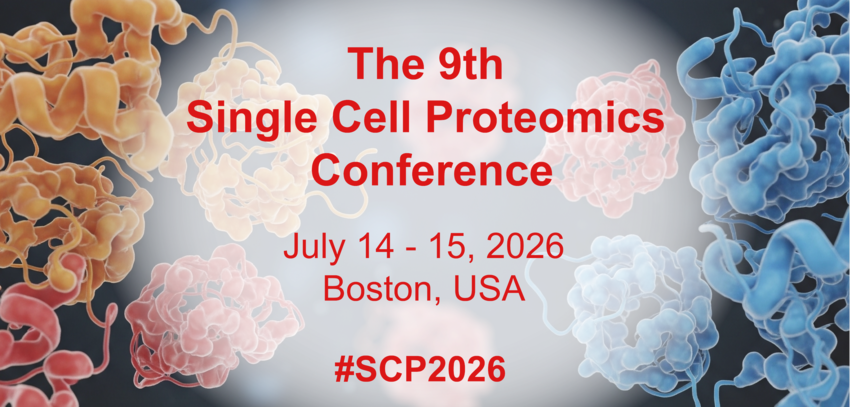



# SCP2026
## July 14 - 15, 2026 &nbsp; |  &nbsp;  Boston, USA
### [Hands-on workshop](#workshop) on July 16, 2026.
In-person conference registration is required to attend the workshop. After completing conference registration, you can save your spot on the workshop waitlist by signing up through the workshop registration form. Due to limited space, individuals will be notified about workshop participation.

&nbsp;

[Register](#register-and-submit-abstracts){: .btn .fs-5 .mb-4 .mb-md-0 .mr-2 }
[Program](#program){: .btn .fs-5 .mb-4 .mb-md-0 .mr-2 }
<!-- [Speakers](#speakers){: .btn .fs-5 .mb-4 .mb-md-0 .mr-2 } -->
[Sponsors](#sponsors){: .btn .fs-5 .mb-4 .mb-md-0 .mr-2 }

&nbsp;

{:width="80%" .center-image}

&nbsp;

The 9th Single Cell Proteomics Conference (SCP2026) will be held at Northeastern University in Boston, USA. It will be at [Northeastern University](https://center.single-cell.net/) in the [John D. O'Bryant building](https://goo.gl/maps/bmtkmHuFHGC9w8Db8), 1st floor (<a href="https://www.northeastern.edu/campusmap/printable/campusmap15.pdf">40 Leon Street</a>).

## Due to technical difficulties, Tuesday afternoon presentations will be held in 164 Snell Engineering Building (360 Huntington Ave, Boston, MA 02115)

## Wednesday's presentations will be at the Curry Student Center (Room TBD), 360 Huntington Ave, Boston, MA 02115 

<!--
We will also broadcast **virtual components**. Virtual attendance is free of charge but requires a [registration](#virtual).
-->

## Register and submit abstracts

  Registration for the conference is closed.

 

<!--

<a href="https://forms.gle/uH9zspns3YoSyLS27" target="_blank" >Register for <strong>virtual</strong> SCP2026</a>

Registration deadline: July 12, 2026.

 

<a href="https://single-cell.net/SCP_Meeting/Hotels_2026" target="_blank" rel="noopener noreferrer">Reserve a hotel</a>

  -->

Abstract submission is now closed.

<!--

Register for SCP2026

In person registration is closed due to limited space. Please contact slavov.office@parallelsq.org to be put on a waitlist.  

<a href="https://single-cell.net/SCP_Meeting/Hotels_2026" target="_blank" rel="noopener noreferrer">Reserve a hotel</a>

<a href="https://forms.gle/jA11ZoiPZgB2oEzt8" target="_blank" rel="noopener noreferrer">Submit an abstract</a>

Abstract deadline: April 1, 2026

-->

<!--

<a href="https://forms.gle/2G493pgjJCg9DwK49" target="_blank" >Register for <strong>virtual</strong> SCP2026</a>

Deadline: May 27, 2024

<a href="https://forms.gle/2G493pgjJCg9DwK49" target="_blank" >Register for <strong>virtual</strong> SCP2024</a>

Deadline: May 27, 2024

 
 

Enjoy recorded <a href="https://www.youtube.com/@NikolaiSlavovResearch/playlists?view=50&sort=dd&shelf_id=2" >presentations</a> from past <a href="https://slavovlab.net/research.htm#Single-Cell-Proteomics-Conference" >SCP meetings</a>.

<a href="https://single-cell.net/SCP_Meeting/Hotels_2024" target="_blank" rel="noopener noreferrer"><b>Reserve a hotel</b></a>

-->

 

## Program
* [Day 1](#day1)
* [Day 2](#day2)
* [Workshop](#workshop)

<!--
## Program
* [Tuesday, July 14](#day1)
* [Wednesday, July 15](#day2)
* [Thursday, July 16](#workshop)
-->

&nbsp;

 

&nbsp;

 

<strong>Tuesday, July 14</strong> 

 

As usual for the meeting, we will have ample time for formal and informal discussions.   

*Breakfast and lunch will be provided on site.*

 

<table class="SCPtable" ><tr><td> Speaker </td><td> Title </td><td> ET </td><td> GMT </td><td> Your local time </td></tr>
<tr><td>  </td><td> Registration and breakfast </td><td> 8:30 </td><td> 12:30 </td><td>  </td></tr>
<tr><td> Nikolai Slavov, Northeastern University / Parallel Squared Technology Institute </td><td> Opening remarks </td><td> 9:00 </td><td> 13:00 </td><td>  </td></tr>
<tr><td> Theodore Alexandrov, University of California, San Diego </td><td> Single-cell metabolomics for revealing drug responses and predicting toxicity </td><td> 9:10 </td><td> 13:10 </td><td>  </td></tr>
<tr><td>  </td><td> Discussion </td><td> 9:35 </td><td> 13:35 </td><td>  </td></tr>
<tr><td> Luke Khoury, Northeastern University </td><td> Decoding functional and molecular coordination within and across diverse human immune cells </td><td> 9:50 </td><td> 13:50 </td><td>  </td></tr>
<tr><td>  </td><td> Discussion </td><td> 10:10 </td><td> 14:10 </td><td>  </td></tr>
<tr><td>  </td><td> General discussion & Coffee Break </td><td> 10:20 </td><td> 14:20 </td><td>  </td></tr>
<tr><td> Giulia Barotti, Albert Einstein College of Medicine </td><td> High-Throughput Single-Cell Proteomics Enabled with Hyperplexing Barcoding of Peptides </td><td> 11:10 </td><td> 15:10 </td><td>  </td></tr>
<tr><td>  </td><td> Discussion </td><td> 11:20 </td><td> 15:20 </td><td>  </td></tr>
<tr><td> Flash Talk #1: Md Nazibul Islam, University of California, Berkeley </td><td> BlotSeq: Linking chromatin state to protein function in single cells </td><td> 11:25 </td><td> 15:25 </td><td>  </td></tr>
<tr><td> Flash Talk #2: Boryana Petrova, Medical University of Vienna </td><td> Single Cell High Throughput Quantitative Metabolomics - an Update </td><td> 11:29 </td><td> 15:29 </td><td>  </td></tr>
<tr><td> Flash Talk #3: Lihe Zhang, Astrazeneca </td><td> Low-input phosphoproteomics for FFPE clinical samples: Application of a sensitive FAIMS-PRM assay for biomarker measurement and translational insights </td><td> 11:33 </td><td> 15:33 </td><td>  </td></tr>
<tr><td> Flash Talk #4: Jijumon A S, Stanford University </td><td> Proteomic Analysis of Protein Condensates Using Ballistic Microscopy (BaM) and Mass Spectrometry </td><td> 11:37 </td><td> 15:37 </td><td>  </td></tr>
<tr><td> Flash Talk #5: Gulam Sarwar Chuwdhury, Iowa State University </td><td> Mapping protein interaction landscapes for deep analysis of single-cell proteomics data </td><td> 11:41 </td><td> 15:41 </td><td>  </td></tr>
<tr><td> Flash Talk #6: Romell Bernard Gletten, Translational Genomics Research Institute (TGen) </td><td> Probing GBM patient-derived organoid cellular subpopulations using label-free DIA single-cell proteomics </td><td> 11:45 </td><td> 15:45 </td><td>  </td></tr>
<tr><td> Flash Talk #7: Arzu Tugce Gueler, Northeastern University (Institute for Experiential AI) </td><td> Improving Absolute Quantitation of Peptides in Bottom-Up Proteomics </td><td> 11:49 </td><td> 15:49 </td><td>  </td></tr>
<tr><td> Flash Talk #8: Maya Overton, University of California, Berkeley </td><td> Single-cell Mass Spectrometry Proteomics Paired with Imaging-Based Morphology </td><td> 11:53 </td><td> 15:53 </td><td>  </td></tr>  
<tr><td>  </td><td> Group Photo </td><td> 12:00 </td><td> 16:00 </td><td>  </td></tr>
<tr><td>  </td><td> Lunch & Poster Session 1 </td><td> 12:15 </td><td> 16:15 </td><td>  </td></tr>
<tr><td> Ryan Kelly, Brigham Young University </td><td> Label-free single-cell proteome profiling at up to 500 samples per day </td><td> 2:00 </td><td> 18:00 </td><td>  </td></tr>
<tr><td>  </td><td> Discussion </td><td> 2:20 </td><td> 18:20 </td><td>  </td></tr>
<tr><td> Sara Tavana, Massachusetts Institute of Technology </td><td> Principles of In Situ Single-Molecule Protein Sequencing: Expansion Microscopy, Iterative Edman Degradation, and Engineered Amino Acid Binders </td><td> 2:30 </td><td> 18:30 </td><td>  </td></tr>
<tr><td>  </td><td> Discussion </td><td> 2:45 </td><td> 18:45 </td><td>  </td></tr>
<tr><td> Maxwell Horton, Albert Einstein College of Medicine </td><td> Single-cell proteomics reveals an age-associated collapse of translational heterogeneity in mouse hepatocytes </td><td> 2:55 </td><td> 18:55 </td><td>  </td></tr>
<tr><td>  </td><td> Discussion </td><td> 3:10 </td><td> 19:10 </td><td>  </td></tr>
<tr><td> Yanbao Yu, University of Delaware </td><td> Novel in-cell technology for low-input proteomics </td><td> 3:20 </td><td> 19:20 </td><td>  </td></tr>
<tr><td>  </td><td> Discussion </td><td> 3:30 </td><td> 19:30 </td><td>  </td></tr>
<tr><td>  </td><td> Coffee Break & Poster session </td><td> 3:35 </td><td> 19:35 </td><td>  </td></tr>
<tr><td> Samantha O'Connor, Translational Genomics Research Institute (TGen) </td><td> Developing a ground-truth anchored framework for single-cell proteomics analysis </td><td> 4:20 </td><td> 20:20 </td><td>  </td></tr>
<tr><td>  </td><td> Discussion </td><td> 4:35 </td><td> 20:35 </td><td>  </td></tr>
<tr><td> Shelby Ruiz, University of Pittsburgh </td><td> Exploring hepatocyte diversity with single cell proteomics </td><td> 4:45 </td><td> 20:45 </td><td>  </td></tr>
<tr><td>  </td><td> Discussion </td><td> 5:00 </td><td> 21:00 </td><td>  </td></tr>
<tr><td> Xuling Xu, Monash University </td><td> Parallel transcriptome and proteome profiling of individual cells </td><td> 5:10 </td><td> 21:10 </td><td>  </td></tr>
<tr><td>  </td><td> Discussion </td><td> 5:25 </td><td> 21:25 </td><td>  </td></tr>
<tr><td> Ying Zhu, Genentech </td><td> Ultrasensitive Surface Proteomics for Therapeutic Target Discovery from Diseased Tissues </td><td> 5:30 </td><td> 21:30 </td><td>  </td></tr>
<tr><td>  </td><td> Discussion </td><td> 5:50 </td><td> 21:50 </td><td>  </td></tr>
<tr><td> Alexander Ivanov, Northeastern University </td><td> Open-tubular liquid-phase separation: strategies for high-sensitivity omic profiling </td><td> 6:00 </td><td> 22:00 </td><td>  </td></tr>
<tr><td>  </td><td> Discussion </td><td> 6:15 </td><td> 22:15 </td><td>  </td></tr>
<tr><td>  </td><td> End Day 1 </td><td> 6:25 </td><td> 22:25 </td><td>  </td></tr>
<tr><td> Dinner (all attendees) </td><td> Rochambeau: 900 Boylston St, Boston </td><td> 7:00 </td><td> 23:00 </td><td>  </td></tr>
</table>

&nbsp;

 

&nbsp;
 

<strong>Wednesday, July 15</strong> 

   

As usual for the meeting, we will have ample time for formal and informal discussions.   

*Breakfast and lunch will be provided on site.*

 

<table class="SCPtable" ><tr><td> Speaker </td><td> Title </td><td> ET </td><td> GMT </td><td> Your local time </td></tr>
<tr><td>  </td><td> Registration and breakfast </td><td> 8:30 </td><td> 12:30 </td><td>  </td></tr>
<tr><td> Matthias Selbach, Max Delbrück Center for Molecular Medicine (MDC), Berlin </td><td> Global quantification of mammalian gene expression noise </td><td> 9:00 </td><td> 13:00 </td><td>  </td></tr>
<tr><td>  </td><td> Discussion </td><td> 9:20 </td><td> 13:20 </td><td>  </td></tr>
<tr><td> Manuel Leonetti, Chan Zuckerberg Biohub San Francisco </td><td> Mapping cellular states with subcellular proteomics and high-throughput imaging </td><td> 9:30 </td><td> 13:30 </td><td>  </td></tr>
<tr><td>  </td><td> Discussion </td><td> 9:50 </td><td> 13:50 </td><td>  </td></tr>
<tr><td>  </td><td> General discussion & Coffee Break </td><td> 10:00 </td><td> 14:00 </td><td>  </td></tr>
<tr><td> Megan Elcheikhali, Parallel Squared Technology Institute </td><td> Identifying cell-type specific protein networks associated with Alzheimer's disease progression and cellular dysfunction </td><td> 10:50 </td><td> 14:50 </td><td>  </td></tr>
<tr><td>  </td><td> Discussion </td><td> 11:10 </td><td> 15:10 </td><td>  </td></tr>
<tr><td> Panel Discussion (Ophir Shalem, Manuel Leonetti, and Nikolai Slavov) </td><td> Urgent needs and great opportunities </td><td> 11:20 </td><td> 15:20 </td><td>  </td></tr>
<tr><td>  </td><td> Lunch & Poster Session 2 </td><td> 12:00 </td><td> 16:00 </td><td>  </td></tr>
<tr><td> Ophir Shalem, University of Pennsylvania </td><td> Toward pooled scalable optical profiling of sub cellular proteome organization </td><td> 2:00 </td><td> 18:00 </td><td>  </td></tr>
<tr><td>  </td><td> Discussion </td><td> 2:25 </td><td> 18:25 </td><td>  </td></tr>
<tr><td> Lisa Iwamoto-Stohl, University of Cambridge / Caltech </td><td> Fertilization Triggers Early Proteomic Symmetry Breaking in Mammalian Embryos </td><td> 2:40 </td><td> 18:40 </td><td>  </td></tr>
<tr><td>  </td><td> Discussion </td><td> 3:00 </td><td> 19:00 </td><td>  </td></tr>
<tr><td> Ronald Cutler, Albert Einstein College of Medicine </td><td> Integrating single-cell transcriptomics, histone PTM profiling, and proteomics to quantify mutation-driven regulatory network destabilization </td><td> 3:10 </td><td> 19:10 </td><td>  </td></tr>
<tr><td>  </td><td> Discussion </td><td> 3:25 </td><td> 19:25 </td><td>  </td></tr>
<tr><td> Benjamin Furtwängler, Technical University of Denmark </td><td> Extending the toolkit for quantitative DIA-based single-cell proteomics </td><td> 3:30 </td><td> 19:30 </td><td>  </td></tr>
<tr><td>  </td><td> Discussion </td><td> 3:45 </td><td> 19:45 </td><td>  </td></tr>
<tr><td>  </td><td> Coffee Break & Poster session </td><td> 3:55 </td><td> 19:55 </td><td>  </td></tr>
<tr><td> Yu Gao, University of Illinois Chicago </td><td> Fully automated acoustic levitation system for single-cell processing </td><td> 4:40 </td><td> 20:40 </td><td>  </td></tr>
<tr><td>  </td><td> Discussion </td><td> 5:00 </td><td> 21:00 </td><td>  </td></tr>
<tr><td> Alec Candib, Boston University </td><td> A DIA-Based On-Slide Workflow for Spatial Glycomics and Proteomics Reveals Neurodegeneration-Associated Changes </td><td> 5:10 </td><td> 21:10 </td><td>  </td></tr>
<tr><td>  </td><td> Discussion </td><td> 5:25 </td><td> 21:25 </td><td>  </td></tr>
<tr><td> Diego Assis, Bruker Daltonics </td><td> Label-free and isobaric multiplexing-based single cell proteomics with the BOXmini SCP in scalable workflows on the timsUltra AIP </td><td> 5:30 </td><td> 21:30 </td><td>  </td></tr>
<tr><td>  </td><td> Discussion </td><td> 5:40 </td><td> 21:40 </td><td>  </td></tr>
<tr><td> Bernard Delanghe, Thermo Fisher Scientific </td><td> Advanced workflows for low loads and single cell proteomics </td><td> 5:45 </td><td> 21:45 </td><td>  </td></tr>
<tr><td>  </td><td> Discussion </td><td> 5:55 </td><td> 21:55 </td><td>  </td></tr>
<tr><td> Manveen Sethi, Boston University </td><td> Mapping Disease-Specific PTMs in Alzheimer's Brain by Global and Spatial Mass Spectrometry </td><td> 6:00 </td><td> 22:00 </td><td>  </td></tr>
<tr><td>  </td><td> Discussion </td><td> 6:15 </td><td> 22:15 </td><td>  </td></tr>
<tr><td>  </td><td> Prizes & Closing Remarks </td><td> 6:20 </td><td> 22:20 </td><td>  </td></tr>
</table>

 

<strong>Thurday, July 16 | Workshop</strong> 

 

A full day hands-on workshop at [PTI](https://www.parallelsq.org/) will take participants from biological samples through sample preparation via [nPOP](https://scp.slavovlab.net/nPOP) to mass spectrometry data acquisition and analysis.

&nbsp;

 <!--  *To attend the workshop, you must be registered for the in-person conference and complete the **[Workshop Registration Form](https://forms.gle/CEtKGJz1XMgfxo7d7)**. To facilitate interactions and hands-on experience, participation is limited.*    -->
The workshop is over-subscribed, and the registration is closed.

<!--
 

## Speakers
*SCP2026 Presenters include:*
* Theodore Alexandrov, University of California San Diego
* Giulia Barotti, Albert Einstein College of Medicine
* Alec Candib, Boston University
* Ronald Cutler, Albert Einstein College of Medicine
* Megan Elcheikhali, Parallel Squared Technology Institute
* Benjamin Furtwängler, Technical University of Denmark
* Maxwell Horton, Albert Einstein College of Medicine
* Lisa Iwamoto-Stohl, Gladstone Institutes
* Ryan Kelly, Brigham Young University
* Luke Khoury, Northeastern University
* Manuel Leonetti, Chan Zuckerberg Biohub
* Samantha O'Connor, The Translational Genomics Research Institute
* Shelby Ruiz, University of Pittsburgh
* Mattias Selbach, Max Delbruck Center
* Manveen Sethi, Boston University
* Ophir Shalem, University of Pennsylvania
* Sara Tavana, MIT
* Xuling Xu, Monash University
* Yanbao Yu, University of Delaware
* Ying Zhu, Genentech
* Yu Gao, University of Chicago Illinois
  
 
 
-->

&nbsp;

  
<strong><a href="#program">Back to the Program</a></strong>

&nbsp;

&nbsp;

# Sponsors

## Platinum sponsors

{:width="50%" .center-image}

&nbsp;

&nbsp;

## Gold sponsors

[{:width="30%" .center-image}](https://ionopticks.com/)

[{:width="60%" .center-image}](https://www.parallelsq.org)

&nbsp;

&nbsp;

## Silver sponsors

[{:width="30%" .center-image}](https://esisourcesolutions.com/)

&nbsp;

[{:width="30%" .center-image}](https://affinisep.com)

&nbsp;

[{:width="30%" .center-image}](https://www.evosep.com)

&nbsp;

[{:width="30%" .center-image}](https://www.cytosurge.com)

&nbsp;

[{:width="30%" .center-image}](https://www.cellenion.com)

&nbsp;

<!--

{:width="60%" .center-image}

&nbsp;

&nbsp;

## Silver sponsors

[{:width="30%" .center-image}](https://ionopticks.com/)

&nbsp;

&nbsp;

[{:width="30%" .center-image}](https://www.evosep.com)

&nbsp;

&nbsp;

[{:width="30%" .center-image}](https://affinisep.com)

&nbsp;

&nbsp;

[{:width="30%" .center-image}](https://www.cellsorter-scientific.com/)

&nbsp;

&nbsp;

&nbsp;

[{:width="30%" .center-image}](https://www.newobjective.com/)

&nbsp;

&nbsp;

[{:width="30%" .center-image}](https://www.proteomics.com/)

&nbsp;

&nbsp;

<strong><a href="#program">Back to the Program</a></strong>

  &nbsp;

  &nbsp;
-->  

<!--
* Peter Nemes, University of Maryland
* Alexey Nesvizhskii, University of Michigan
* Aleksandra Petelski, Northeastern University
* Chris Rose, Genentech

* Savas Tay, University of Chicago
* Catherine Wong, Peking University Health Science Center

## Speakers

* Kristin Burnum-Johnson, PNNL
* Jürgen Cox,	Max Planck Institute of Biochemistry
* Amy Herr, UC Berkeley
* Ryan Kelly, Brigham Young University
* Jeroen Krijgsveld, Heidelberg University
* Emma Lundberg, KTH Royal Institute of Technology
* Matthias Mann, Max Planck Institute of Biochemistry
* Peter Nemes, University of Maryland
* Nikolai Slavov,	Northeastern University
* Peter Smibert, New York Genome Center
* John Yates, The Scripps Research Institute

* Ruedi Aebersold, ETH Zurich
* Chloe Baron, Harvard Medical School
* Sean Bendall, Stanford University

* Bogdan Budnik, Harvard University
* Akos Vegvari, Karolinska Institutet
* Catherine Wong, Peking University Health Science Center
* Sydney Shaffer, University of Pennsylvania
* Tami Geiger,	Tel Aviv University
* Luca Pinello, Harvard Medical School
* Jessica, Polka, ASAPbio  

{:.no_toc}

* Will be replaced with the ToC, excluding the section header
{:toc}

{:width="30%" .center-image}

&nbsp;

&nbsp;

&nbsp;
-->
